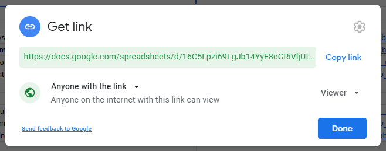







WFU can use public Google Sheets as a data source.

## DEMO - Google Sheet to JSON

Retrieve data from a Google sheet, and convert it to JSON.

*Requires a Google Sheet ID which is configured for public read access.*

Demonstration

    <pre>Loading...</pre>

<a class="button is-primary" href="https://docs.google.com/spreadsheets/d/16lPOiFz5Ow-FTro5SWS-m00fNhRjgsiyeSBdme3gKX0/edit#gid=0" target="_blank">Open Google Sheet</a>

## Usage Notes

Make certain that the Google Sheet is publicly accessible for read-only viewing. This is what the sharing settings will look like.

